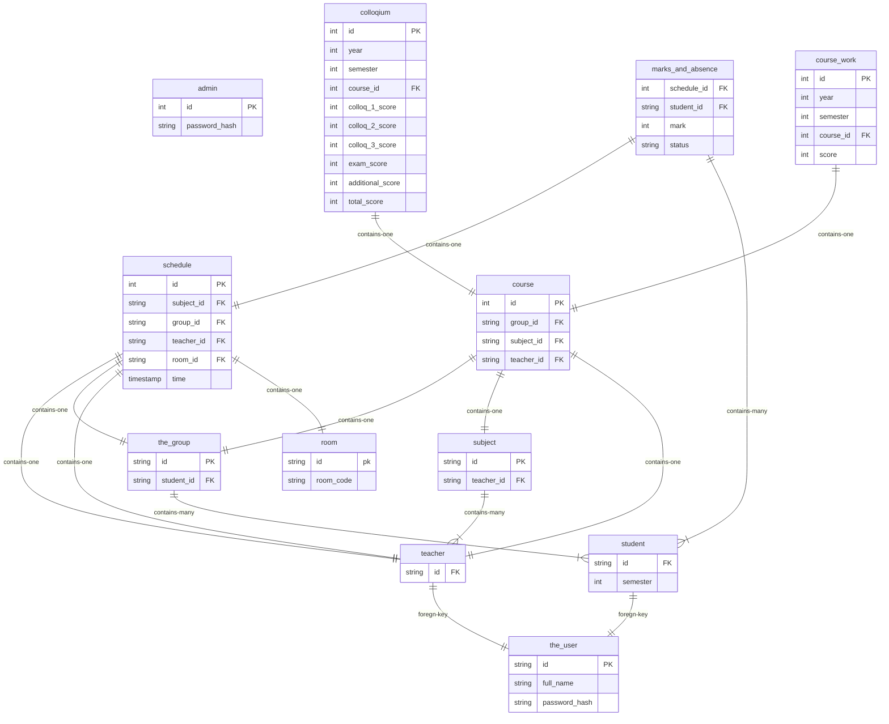

here is my postgres db diagram written in mermaid





here is the essential handlers i want

```
# Handlers

## Teacher
- login
- get_teacher_schedule
- stream_qr_codes

## Student
- login
- get_student_schedule
- scan_and_send_qr_codes
```


based on this data

write openapi.yaml file to generate server in go language and server in ts
